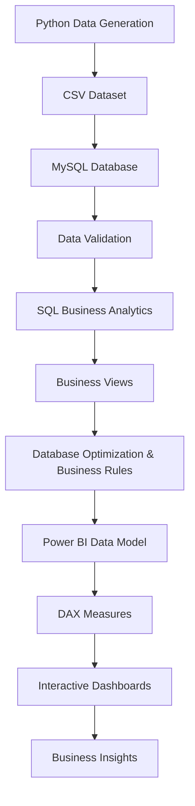
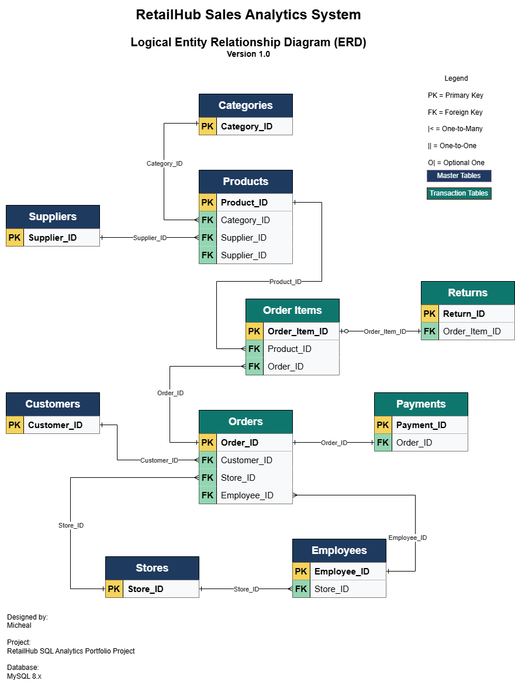
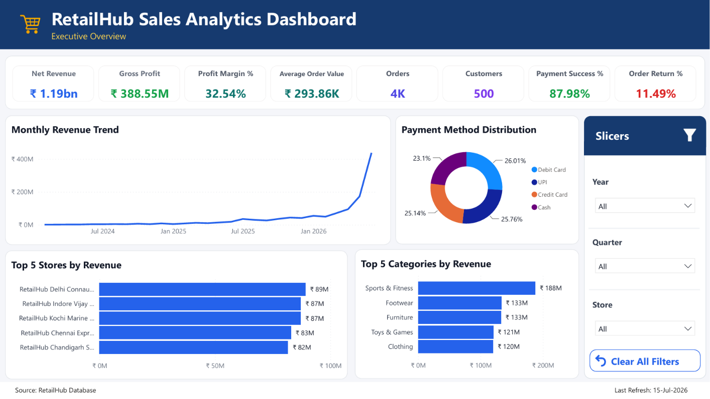
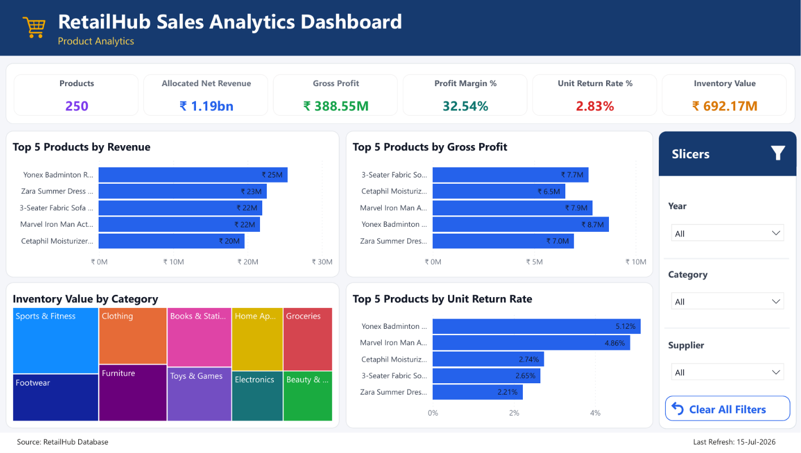
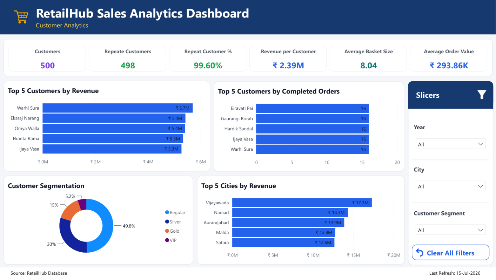
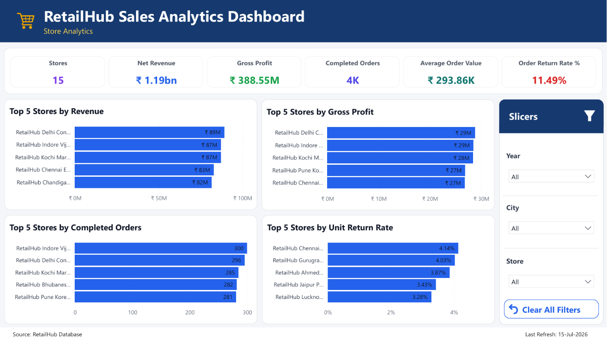
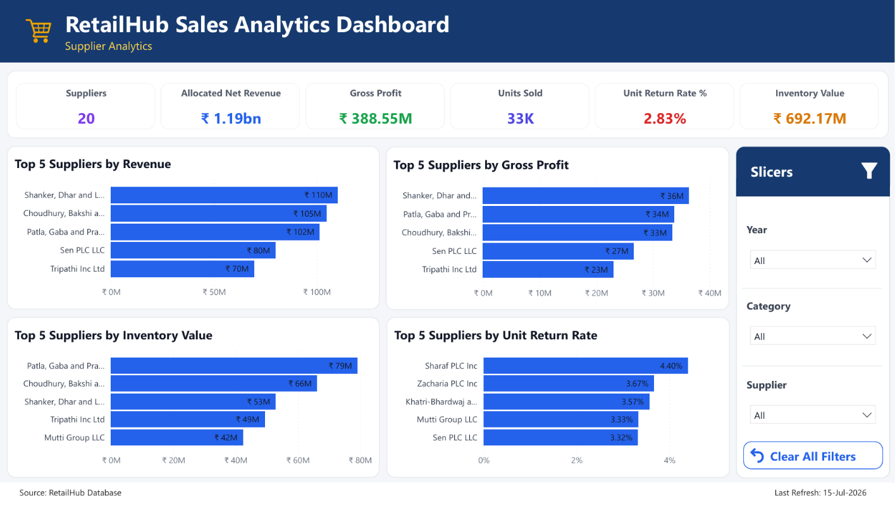
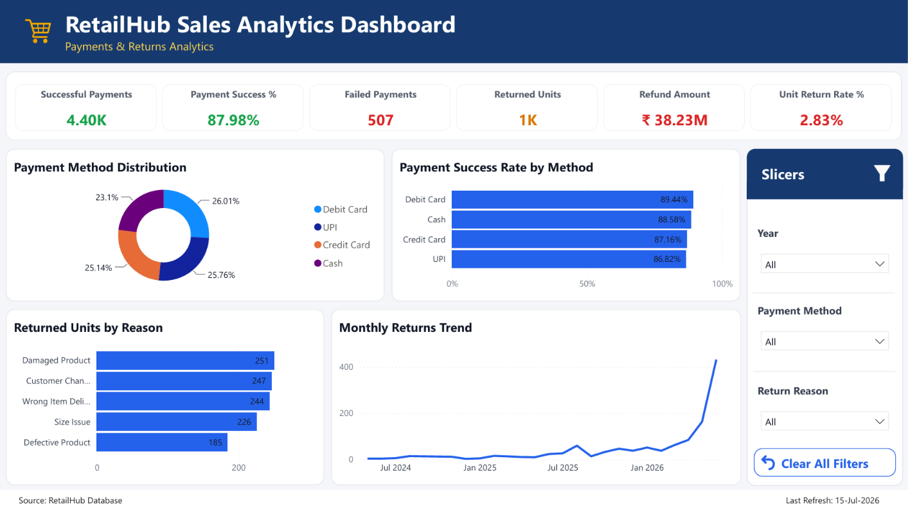

# 🏪 RetailHub Sales Analytics System <a id="top"></a>


> **An end-to-end Retail Sales Analytics solution built using MySQL, Python, and Power BI.**

RetailHub Sales Analytics System is an end-to-end data analytics project that simulates the data ecosystem of a modern retail business.

The project demonstrates the complete lifecycle of a data analytics solution from synthetic data generation and relational database design to SQL analytics, reusable business views, and interactive Power BI dashboards.

---

##  Table of Contents

- [Project Snapshot](#project-snapshot)
- [Project Workflow](#project-workflow)
- [Project Overview](#project-overview)
- [Business Problem](#business-problem)
- [Project Objectives](#project-objectives)
- [Skills Demonstrated](#skills-demonstrated)
- [Technology Stack](#technology-stack)
- [Repository Structure](#repository-structure)
- [SQL Concepts Demonstrated](#sql-concepts-demonstrated)
- [Business Analysis Modules](#business-analysis-modules)
- [Business Views](#business-views)
- [Database Design](#database-design)
- [Entity Relationship Diagram](#entity-relationship-diagram)
- [Power BI Dashboard](#power-bi-dashboard)
- [Key Business Insights](#key-business-insights)
- [How to Run the Project](#how-to-run-the-project)
- [Future Enhancements](#future-enhancements)

---

##  Project Snapshot

| Metric | Value |
|---------|------:|
| Database Tables | 10 |
| Business Analysis Modules | 9 |
| Business KPIs | 80+ |
| SQL Views | 11 |
| Indexes | 16 |
| Triggers | 10 |
| Power BI Dashboard Pages | 6 |
| Categories | 10 |
| Suppliers | 20 |
| Stores | 15 |
| Customers | 500 |
| Employees | 80 |
| Products | 250 |
| Orders | 5,000 |
| Order Items | 13,500 |
| Payments | 5,000 |
| Returns | 395 |

---
[⬆ Back to Top](#top)

##  Project Workflow



---
[⬆ Back to Top](#top)

##  Project Overview

RetailHub Sales Analytics System is an end-to-end retail analytics solution designed to demonstrate modern SQL development, performance optimization, and business intelligence workflows.

The solution follows a layered analytics architecture consisting of:

- Synthetic Data Generation
- Relational Database Design
- Data Validation
- SQL Business Analytics
- Reusable Business Views
- Performance Optimization
- Database Business Rule Enforcement
- Power BI Data Modeling
- DAX Measure Development
- Interactive Dashboard Development
- Business Insight Generation

---
[⬆ Back to Top](#top)

##  Business Problem

Retail organizations generate thousands of transactions every day.

Without structured analysis, it becomes difficult to answer critical business questions such as:

- Which products generate the highest revenue?
- Which suppliers contribute the most business value?
- Which stores perform best?
- Who are the most valuable customers?
- Which payment methods are most successful?
- What products are frequently returned?
- How efficiently is inventory managed?

RetailHub demonstrates how SQL and business intelligence tools can transform operational retail data into actionable insights.

---
[⬆ Back to Top](#top)

##  Project Objectives

- Design a normalized relational database
- Generate realistic synthetic datasets using Python
- Validate data quality and business rules using SQL
- Perform business-focused SQL analytics
- Create reusable SQL business views
- Optimize query performance using indexes
- Automate and enforce business rules using triggers
- Build a structured Power BI data model
- Develop business-focused DAX measures and KPIs
- Create interactive Power BI dashboards
- Transform analytical results into actionable business insights
- Demonstrate end-to-end SQL and business intelligence development practices

---
[⬆ Back to Top](#top)

##  Skills Demonstrated

### Database Design
- Relational Database Design
- Database Normalization
- Primary & Foreign Keys
- Constraints & Referential Integrity

### Programming & Data Generation
- Python
- Pandas
- Faker
- Synthetic Data Generation
- CSV Data Processing

### SQL Development
- Complex Joins
- Common Table Expressions (CTEs)
- Window Functions
- Subqueries
- CASE Expressions
- Aggregate Functions
- Views
- Triggers
- Indexes
- Data Validation
- Business Rule Validation

### Data Analytics
- Business KPI Development
- Revenue & Profitability Analysis
- Order Analysis
- Product & Inventory Analysis
- Customer Analytics
- Store Performance Analysis
- Supplier Analytics
- Payment Analytics
- Return & Refund Analysis

### Business Intelligence
- Power BI Data Modeling
- DAX Measure Development
- Interactive Dashboard Development
- KPI & Visual Design
- Slicers & Cross-Filtering
- Data Visualization
- Data Storytelling
- Business Reporting

---
[⬆ Back to Top](#top)

##  Technology Stack

| Technology | Role |
|------------|------|
| MySQL 8.0 | Relational Database, SQL Analytics & Database Development |
| Python 3.x | Synthetic Data Generation |
| Pandas | Data Processing & CSV Generation |
| Faker | Realistic Synthetic Data Generation |
| Power BI | Data Modeling, DAX & Interactive Dashboards |
| Git & GitHub | Version Control & Project Documentation |
| Mermaid | Workflow & Architecture Documentation |

---
[⬆ Back to Top](#top)

##  Repository Structure
```
RetailHub-SQL-Analytics-System/
│
├── 01_Database/
├── 02_Validation/
├── 03_Analysis/
├── 04_Views/
├── 05_Performance_Optimization/
├── 06_Database_Triggers/
├── 07_Dataset/
├── 08_Python_Data_Generation/
├── 09_Docs/
├── 10_Screenshots/
├── 11_Power_BI/
│
├── .gitignore
├── LICENSE.txt
├── README.md
└── requirements.txt
```

---
[⬆ Back to Top](#top)

##  SQL Concepts Demonstrated

| Category | Concepts |
|----------|----------|
| Database Design | DDL, Constraints, Primary Keys, Foreign Keys, Referential Integrity |
| Data Manipulation | DML, INSERT, UPDATE, DELETE |
| Query Development | SELECT, JOINs, GROUP BY, HAVING, ORDER BY, CASE |
| Advanced SQL | CTEs, Window Functions, Subqueries |
| Data Validation | NULL Checks, Duplicate Detection, Referential Integrity Checks, Business Rule Validation |
| Database Objects | Views, Triggers |
| Performance Optimization | Indexes, Query Optimization |
| Business Analytics | KPI Development, Aggregations, Ranking, Revenue, Profitability, Customer, Product, Store, Supplier, Payment & Return Analysis |

---
[⬆ Back to Top](#top)

##  Business Analysis Modules

The project is organized into nine business-focused analytical modules, each designed to answer real-world retail questions and support data-driven decision-making.

| Module | Business Focus |
|----------|----------------|
| 📈 Overall KPIs | Executive-level business performance, sales, orders, customers, and operational KPIs |
| 💰 Revenue Analysis | Revenue trends, gross and net revenue, profitability, discounts, and revenue contribution |
| 🛒 Order Analysis | Order volumes, order status, basket size, and purchasing patterns |
| 📦 Product Analysis | Product and category performance, units sold, revenue, profitability, and inventory |
| 🏪 Store Analysis | Store-level revenue, orders, profitability, and operational performance |
| 👥 Customer Analysis | Customer value, purchasing behavior, repeat customers, segmentation, and revenue contribution |
| 🚚 Supplier Analysis | Supplier revenue contribution, units sold, inventory value, margins, and return performance |
| 💳 Payment Analysis | Payment methods, transaction status, payment success rates, and payment trends |
| ↩️ Return Analysis | Returned units, return rates, refund amounts, return reasons, and product quality indicators |

---
[⬆ Back to Top](#top)

##  Business Views

To improve query reusability and simplify reporting, reusable semantic SQL views were created to serve as the analytical layer of the project.

| View | Purpose |
|------|---------|
| `vw_completed_orders` | Completed sales transactions |
| `vw_order_details` | Central fact view containing orders, customers, products, stores, and employees |
| `vw_product_summary` | Product-level sales and revenue metrics |
| `vw_store_summary` | Store performance metrics |
| `vw_customer_summary` | Customer purchasing and revenue summary |
| `vw_supplier_summary` | Supplier sales and performance summary |
| `vw_payment_summary` | Payment transaction details |
| `vw_return_summary` | Return and refund analysis |
| `vw_inventory_summary` | Inventory valuation and stock analysis |
| `vw_product_inventory` | Live stock levels, product tracking, and inventory availability metrics |
| `vw_sales_fact` | Consolidated sales fact view for analytical reporting |

---
[⬆ Back to Top](#top)

##  Database Design

The RetailHub database follows a normalized relational design consisting of ten interconnected tables representing the core operations of a retail business.

The schema follows Third Normal Form (3NF) to minimize redundancy, maintain data integrity, and support structured analytical reporting.

### Core Business Entities

- Categories
- Suppliers
- Stores
- Products
- Customers
- Employees
- Orders
- Order Items
- Payments
- Returns

Relationships between entities are implemented using Primary Keys and Foreign Keys to maintain referential integrity.

---
[⬆ Back to Top](#top)

##  Entity Relationship Diagram

The following ER diagram illustrates the relational structure and relationships between the core entities in the RetailHub database.



---
[⬆ Back to Top](#top)

##  Power BI Dashboard

The RetailHub Power BI report transforms the analytical data model into an interactive business intelligence solution for monitoring retail performance across sales, products, customers, stores, suppliers, payments, and returns.

The report contains six analytical dashboard pages:

### 1. Executive Overview

Provides a high-level view of overall business performance using key financial, customer, order, return, and payment metrics.

**Key KPIs**
- Net Revenue
- Gross Profit
- Average Order Value
- Inventory Value
- Completed Orders
- Customers
- Order Return Rate %
- Payment Success %

**Key Visuals**
- Monthly Revenue Trend
- Top 5 Categories by Revenue
- Top 5 Stores by Revenue
- Payment Method Distribution



---

### 2. Product Analytics

Analyzes product-level revenue, profitability, inventory, and return performance.

**Key KPIs**
- Products
- Allocated Net Revenue
- Gross Profit
- Profit Margin %
- Inventory Value
- Unit Return Rate %

**Key Visuals**
- Top 5 Products by Revenue
- Top 5 Products by Gross Profit
- Inventory Value by Category
- Top 5 Products by Unit Return Rate



---

### 3. Customer Analytics

Examines customer purchasing behavior, repeat activity, spending patterns, segmentation, and geographic revenue contribution.

**Key KPIs**
- Customers
- Repeat Customers
- Repeat Customer %
- Revenue per Customer
- Average Basket Size
- Average Order Value

**Key Visuals**
- Top 5 Customers by Revenue
- Top 5 Customers by Completed Orders
- Customer Segmentation
- Top 5 Cities by Revenue



---

### 4. Store Analytics

Compares store-level sales, profitability, order activity, and return performance.

**Key KPIs**
- Stores
- Net Revenue
- Gross Profit
- Completed Orders
- Average Order Value
- Order Return Rate %

**Key Visuals**
- Top 5 Stores by Revenue
- Top 5 Stores by Gross Profit
- Top 5 Stores by Completed Orders
- Top 5 Stores by Unit Return Rate



---

### 5. Supplier Analytics

Evaluates supplier contribution across revenue, profitability, sales volume, inventory exposure, and product returns.

**Key KPIs**
- Suppliers
- Allocated Net Revenue
- Gross Profit
- Units Sold
- Inventory Value
- Unit Return Rate %

**Key Visuals**
- Top 5 Suppliers by Revenue
- Top 5 Suppliers by Gross Profit
- Top 5 Suppliers by Inventory Value
- Top 5 Suppliers by Unit Return Rate



---

### 6. Payments & Returns Analytics

Monitors payment reliability and product return activity to identify transaction issues, refund exposure, and major return drivers.

**Key KPIs**
- Successful Payments
- Payment Success %
- Failed Payments
- Returned Units
- Refund Amount
- Unit Return Rate %

**Key Visuals**
- Payment Method Distribution
- Payment Success Rate by Method
- Returned Units by Reason
- Monthly Returns Trend



---
[⬆ Back to Top](#top)

## Key Business Insights

### Revenue & Profitability
- Total Net Revenue reached ₹1.19 billion.
- Gross Profit reached ₹388.55 million.
- Overall Profit Margin was 32.54%.

### Product Performance
- Sports & Fitness was the highest-revenue category.
- Reebok 6mm Yoga Mat Classic was the highest-revenue product.

### Store Performance
- RetailHub Delhi Connaught Place generated the highest net revenue.

### Customer Performance
- Warhi Sura was the highest-revenue customer.

### Supplier Performance
- Shanker, Dhar and Lanka and Sons recorded the highest revenue contribution.

### Payments & Returns
- Payment Success Rate was 87.98%.
- Debit Card accounted for the largest share of successful payments.
- Damaged Product was the leading return reason.
- Unit Return Rate was 2.83%.

### Inventory
- Current inventory value reached ₹692.17 million.
- 38 products were below their reorder level.

---
[⬆ Back to Top](#top)

## How to Run the Project

1. Clone the repository.
2. Install the required Python dependencies from `requirements.txt`.
3. Run the Python data-generation scripts in `08_Python_Data_Generation/` if the datasets need to be regenerated.
4. Execute the SQL scripts in numerical order:
   - `01_Create_Database.sql`
   - `02_Create_Tables.sql`
   - `03_Load_Data.sql`
   - `04_Data_Validation.sql`
   - `05_Sales_Analysis.sql`
   - `06_Create_Views.sql`
   - `07_Create_Indexes.sql`
   - `08_Triggers.sql`
   - `09_Key_Business_Insights.sql`
5. Open `RetailHub_Sales_Analytics.pbix` from `11_Power_BI/`.
6. Update the MySQL data-source credentials if required and refresh the Power BI model.

---
[⬆ Back to Top](#top)

## Future Enhancements

The current version establishes a complete end-to-end retail analytics solution. Future versions can extend the system with additional database automation, advanced analytics, and reporting capabilities.

- Develop stored procedures for reusable database operations and analytical workflows.
- Build a detailed large-canvas Power BI report with Top 10 analysis and additional drill-down visuals.
- Implement Power BI drill-through pages for detailed product, customer, store, and supplier analysis.
- Add historical inventory snapshots to enable inventory trend analysis over time.
- Introduce advanced customer analytics such as RFM (Recency, Frequency, Monetary) segmentation.
- Develop sales forecasting and demand prediction using Python.
- Add automated data refresh and ETL workflows.
- Extend performance testing and query optimization for larger datasets.
- Deploy the analytics solution using cloud-based database and BI services.

---

[⬆ Back to Top](#top)